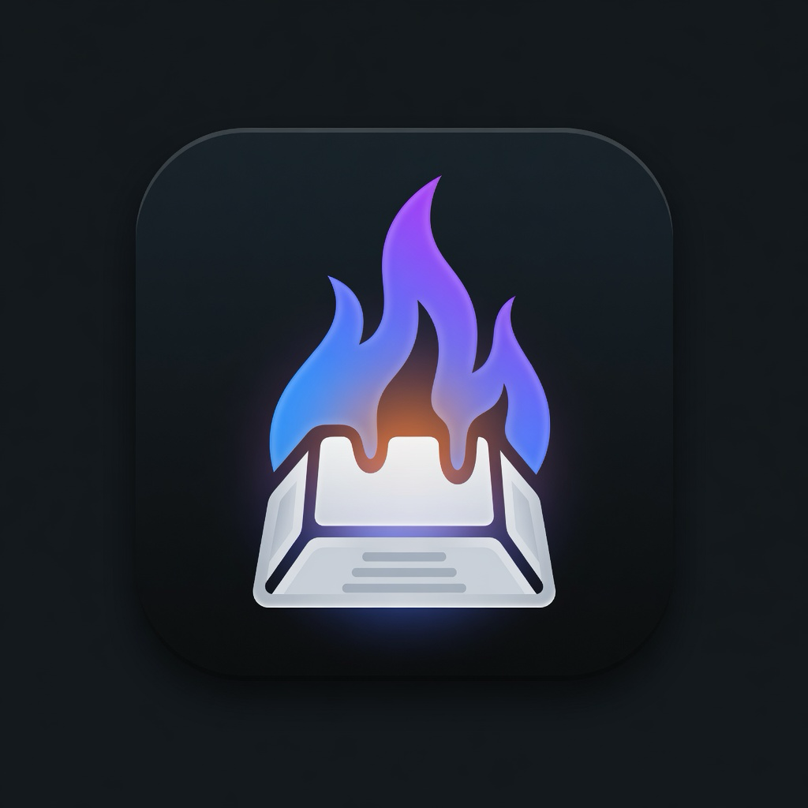

# HyperForge

<p align="center">
  
</p>

**Local-first power-user automation for macOS** — Hyper Key, Karabiner, window layouts, and Vim-style navigation in a native SwiftUI app.

Built for restricted environments where Hammerspoon and browser extensions are blocked. Fully **local-first** and private by default.

> Portfolio-ready · Apple Silicon · macOS 14+

---

## Why HyperForge

| Problem | HyperForge |
|--------|------------|
| Hammerspoon blocked | Pure Swift event tap + Accessibility |
| Browser Vimium blocked | Space-layer nav (TouchCursor-style) + link hints |
| Opaque key remaps | Dashboard of every binding + live test |
| Context switching | Profiles (Coding, Music, Browsing, Minimal) |
| Caps Lock wasted | Karabiner Caps → Hyper (F18 or 4-mod) / tap = Escape |
| Flaky help chords | F19/F20 bridges + Doctor health check |

---

## Features

### Hyper Key Central
- Dashboard of all Hyper + Vim bindings (search, filter, categories)
- **Live Test** mode — click any action to fire it
- Engine status (Live / Hyper held / Accessibility)

### Doctor
- One-screen setup health: Accessibility, engine, Karabiner rules, Hyper style
- One-click install of the recommended Karabiner pack

### Local AI command bar
- **Hyper + Space** — natural language → action
- Offline intent router (always works, fully private)
- Optional **Ollama** on `127.0.0.1` for richer parsing / code generation

### Link hints (Vimium fallback)
- **F18 Hyper + /** — label clickable AX elements system-wide
- Type the hint to press; Esc to cancel
- With **4-mod Hyper**, plain `/` is often help (F19); use link hints from the dashboard or command bar

### Profiles & auto-triggers
- Built-in: **Coding**, **Browsing**, **Music**, **Minimal**
- Custom profiles with action subsets + Karabiner JSON + layouts
- Auto-switch by **Wi‑Fi SSID**, **frontmost app**, or **time window**

### Per-app overrides
- Disable specific Hyper actions in a given app
- Remap Hyper + key → different catalog action per bundle ID

### Portfolio demo export
- One-click pack to Desktop: bindings, profiles, Karabiner rule, architecture notes, screenshots

### Karabiner integration
- **Caps → F18** (classic Hyper Key style)
- **F19** bridge: Hyper + `/` or `` ` `` → cheat sheet (needed for 4-mod Hyper)
- **F20** bridge: Hyper + `,` → dashboard
- One-click write to `~/.config/karabiner/assets/complex_modifications/`

### Space navigation (TouchCursor-style)
- Hold **Space** for h/j/k/l, word hops, gg/G, ⌃d/⌃u page scroll, operators (d, z)
- Tap Space alone still types a space · disable in Settings → Engine if needed

### Workspace & tools
- Save/restore window layouts
- Multi-clipboard history
- Keep-alive (Teams-safe idle pulse), pomodoro, notes, mic toggle, network info
- Configurable preferred terminal (Ghostty, iTerm, Terminal, …)

### Polish
- Dark-mode-first glass UI
- Menu bar popover + main window (Esc hides dashboard)
- Onboarding that explains Accessibility and Hyper styles clearly

---

## Hyper trigger (supported setups)

HyperForge accepts **either** style (and sticky grace for Karabiner flag blips):

### A) F18 (recommended for this app)

1. Karabiner: Caps Lock → `F18`, alone → `Escape`
2. HyperForge listens for `F18` keyDown/keyUp
3. Help: **Hyper + ⇧/** or **Hyper + `** · Link hints: **Hyper + /**
4. Dashboard: **Hyper + ,** or menu bar / **⌘⇧D**

### B) 4-mod Hyper (⌘⌃⌥⇧)

1. Karabiner: Caps Lock → left ⌘⌃⌥⇧, alone → `Escape` (common community rule)
2. HyperForge treats all four modifiers held as Hyper
3. **Shift is always “on”** while Caps is held → install bridges:
   - Hyper + `/` → **F19** (cheat sheet)
   - Hyper + `,` → **F20** (dashboard)
4. Menu bar **Keybindings…** always works without chords

### Always available

| Control | Action |
|---------|--------|
| **Space** held | Nav layer (HJKL arrows, vim motions) |
| Right **⌃** | Alternate Hyper (legacy fallback) |
| Menu bar flame | Dashboard, engine, keybindings |

Engine logic is a modular Swift port of a long-running Hyper Key CGEvent daemon (same muscle memory, structured app shell).

### Sample Hyper chords

| Chord | Action |
|-------|--------|
| Hyper + ←/→/↑/↓ | Snap half |
| Hyper + Return | Maximize |
| Hyper + 6 / ⇧Return | Tile all windows |
| Hyper + H/J/L | Scroll |
| Hyper + K | Keep-alive toggle |
| Hyper + Space | Command bar (local AI) |
| Hyper + Q | Quick menu (cursor) |
| Hyper + Y | AX recipe menu |
| Hyper + A | Always on top |
| Hyper + B | Minimize window |
| Hyper + S | Focus preferred terminal |
| Hyper + P | Pin screen region (drag → stay-on-top) |
| Hyper + ⇧P | Clipboard image pin (F18 extra Shift) |
| Hyper + ⇧V | Paste transform menu |
| Hyper + T | Smart terminal (reuse / new tab) |
| Hyper + ⇧T | Terminal in Finder folder |
| Hyper + ⇧C | Copy selected Finder file text |
| Hyper + ⇧F | Open Finder selection in editor |
| Hyper + ⇧I | Copy IP |
| Hyper + ⇧M | Copy hostname |
| Hyper + / | Cheat sheet (via F19 on 4-mod) · link hints on F18 |
| Hyper + ` | Cheat sheet |
| Hyper + , | Show dashboard (via F20 on 4-mod) |
| Hyper + 1…5 | Chrome / Zed / Teams / VS Code / Zoom |
| Hyper + Esc | Lock screen |
| Hyper + N | Quick note |

**Snippets:** type `,sig`, `@@`, `,date`, `,v`, `,host` (editable under Snippets).

---

## Requirements

- macOS 14+
- Apple Silicon (arm64) recommended
- [Swift toolchain](https://swift.org) / Xcode Command Line Tools
- [Karabiner-Elements](https://karabiner-elements.pqrs.org) (for Caps → Hyper)
- **Accessibility** permission for HyperForge

---

## Build & run

### Quick dev run

```bash
cd ~/code/hyperforge
swift build
swift run HyperForgeSmoke   # pure Kit checks (works with CLT; no Xcode needed)
# swift test                # XCTest suite when full Xcode is installed
swift run
```

### Local DMG (drag → Applications)

```bash
chmod +x Scripts/package-dmg.sh
./Scripts/package-dmg.sh --open
```

Creates `dist/HyperForge-<version>.dmg` with the app, an Applications shortcut, optional Karabiner rule JSON, and install notes. Ad-hoc signed for local use (not notarized — Gatekeeper may prompt once).

### Install as login app (recommended for daily use)

```bash
chmod +x Scripts/install.sh
./Scripts/install.sh
```

This will:

1. `swift build -c release`
2. Package `~/Applications/HyperForge.app`
3. Ad-hoc codesign with stable bundle id `app.hyperforge.HyperForge` (Accessibility survives rebuilds)
4. Install Karabiner pack assets (Caps→F18, F19 help, F20 dashboard) if Karabiner config exists
5. Load LaunchAgent `app.hyperforge`

Then:

1. **System Settings → Privacy & Security → Accessibility → enable HyperForge**
2. **Karabiner → Complex Modifications** → enable Caps Hyper (+ F19/F20 if 4-mod)
3. Open **Doctor** in the app to verify

### Event debug log

```bash
tail -f /tmp/hyperforge-events.log
```

---

## Project structure

```
HyperForge/
├── Package.swift
├── Config/                  # Karabiner pack JSON
├── Scripts/install.sh
├── Sources/
│   ├── HyperForgeKit/       # Pure logic (testable): Karabiner detect, chord routing
│   ├── HyperForge/          # App UI + engine
│   └── HyperForgeSmoke/     # CLI smoke tests (no Xcode required)
├── Tests/HyperForgeTests/   # XCTest (needs full Xcode)
└── README.md
```

Architecture: **MVVM-ish** — `AppState` + stores drive SwiftUI; pure policy lives in **HyperForgeKit**. Dashboard windows are tagged with a stable id and reopened with retries.

---

## Permissions (minimal)

| Permission | Why |
|------------|-----|
| Accessibility | CGEvent tap + window AX + key synthesis |
| AppleEvents (optional) | Terminal / note automation via osascript |

No network required for core Hyper Key. Optional local AI uses Ollama on-device only.

---

## Selling / distribution

Full CGEvent-tap Hyper engine is a better fit for **direct download** from your own site than the Mac App Store sandbox. A future “lite” MAS build could ship without the tap.

---

## Roadmap

- [x] Ollama + offline command bar
- [x] Link-hint mode via Accessibility tree
- [x] Per-app binding overrides
- [x] Auto-triggers (Wi-Fi / app / time → profile)
- [x] Portfolio demo export (markdown + screenshots)
- [x] Doctor + dual Hyper style (F18 / 4-mod) + F19/F20 pack
- [ ] MLX on-device models (no Ollama process)
- [ ] Animated GIF capture for demo pack
- [ ] Sparkle updates (optional)

---

## Origin

HyperForge grew out of a personal Hyper Key CGEvent daemon: same Caps/F18 muscle memory, rebuilt as a local-first SwiftUI companion with Doctor, profiles, Space navigation, and a richer surface area.

---

## License

[MIT](LICENSE) · © Jason Reis · local-first · portfolio-ready
