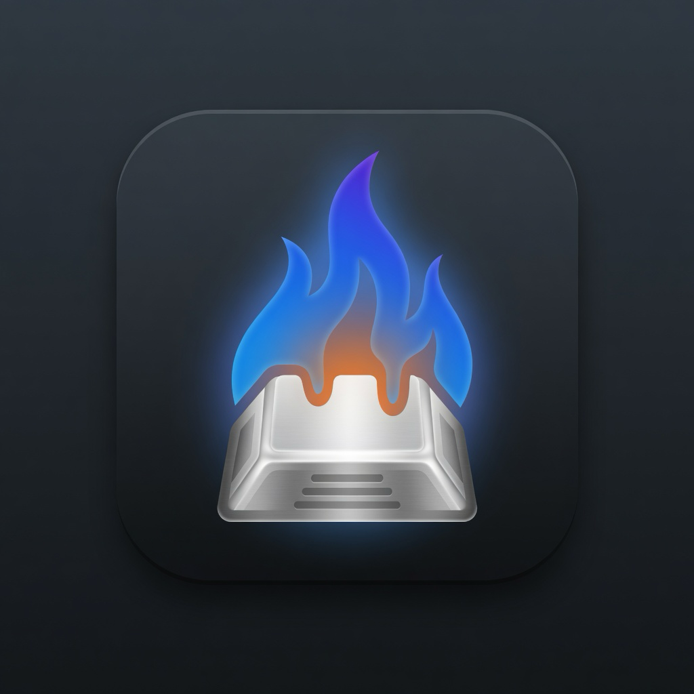

# HyperForge

<p align="center">
  
</p>

<p align="center">
  <strong>Local-first Hyper Key automation for macOS</strong><br/>
  Caps → Hyper · Space-layer navigation · window tiling · snippets · Doctor<br/>
  <em>No cloud · No telemetry · Built for restricted environments</em>
</p>

<p align="center">
  <code>macOS 14+</code>
  ·
  <code>Apple Silicon</code>
  ·
  <code>Swift / SwiftUI</code>
  ·
  <code>MIT</code>
</p>

---

## Platforms

| | |
|--|--|
| **macOS** | Full app (this repo root) — Swift, CGEvent, SwiftUI |
| **[Windows](hyperforge-win/)** | AHK v2 Hyper companion (+ TouchCursor for Space) |
| **[Linux](hyperforge-linux/)** | kanata/keyd + snap scripts (Hyprland / Sway / X11) |

## Why

When **Hammerspoon**, browser extensions, and heavy automation stacks are blocked, you still want power-user flow. HyperForge is a native companion for **Karabiner Hyper** plus a **TouchCursor-style Space layer** — all on-device.

| Constraint | Approach |
|------------|----------|
| No Hammerspoon | Swift `CGEvent` tap + Accessibility |
| No Vimium | Space + HJKL system-wide · optional link hints |
| Opaque remaps | Dashboard + live test + cheat sheet |
| Flaky help chords | Doctor · F19/F20 bridges for 4-mod Hyper |
| Privacy | Local only · optional Ollama on `127.0.0.1` |

---

## Quick start

```bash
git clone https://github.com/jreis/hyperforge.git
cd hyperforge
chmod +x Scripts/install.sh
./Scripts/install.sh
```

Then:

1. **System Settings → Privacy & Security → Accessibility** → enable **HyperForge**
2. **Doctor → Install recommended pack** (or Karabiner → Complex Modifications) → Caps → Hyper (and F19/F20 if you use 4-mod)
3. Open the menu bar flame → **Doctor** and confirm green checks
4. Complete the **three first chords** (onboarding or Dashboard): Hyper · Space+HJKL · Hyper+←
5. Watch for the **NAV** pill when Space is armed; menu bar icon switches to arrows

Dev / smoke (no full Xcode required for Kit checks):

```bash
swift build
swift run HyperForgeSmoke
swift run   # launch the app from the build product
```

---

## Features (core)

- **Hyper Key Central** — searchable catalog, live test, engine status  
- **Doctor** — Accessibility, Karabiner rules, Hyper style, Space nav, Ollama fit  
- **First-run challenge** — prove Hyper, Space+HJKL, and a window snap in ~10 seconds  
- **Space navigation** — hold Space for vim-style motions + edit/clipboard chords; tap Space still types a space  
- **NAV pill + menu bar mode** — floating indicator while Space layer is armed; menu icon switches to arrows  
- **Hold-Hyper HUD** — compact bindings overlay while Caps/Hyper is held (Settings → Engine)  
- **Per-app Space block list** — e.g. keep Terminal normal; allow Ghostty (editable in Settings)  
- **Profiles & auto-triggers** — Coding / Browsing / Music / Minimal; Wi‑Fi, app, or time  
- **Per-app Hyper overrides** — disable or remap chords per bundle ID  
- **Snippets** — local hotstrings; `{{date}}` with custom formats; clipboard / hostname / uuid / lan-ip tokens  
- **Shortcuts** — Hyper + `'` or ⇧S → run installed macOS Shortcuts  
- **Scripts** — Hyper + ⇧Y → run saved JavaScript automations (`HF.snap`, `HF.notify`, `HF.clipboardGet/Set`, …); also in Command Bar / Quick Menu  
- **Window tools** — halves, quarters, **thirds / two-thirds**, almost-max, tile, undo, next/prev display, mouse warp  
- **Clipboard history** — local stack on Hyper + ⇧V (plus paste transforms); no background polling  
- **OCR region** — Hyper + O drag-select → on-device Vision text → clipboard  
- **Region pin** — Hyper + P stay-on-top capture  
- **Command bar** — Hyper + Space; offline router + optional local Ollama  
- **Config backup** — Settings → Privacy → export/import JSON (profiles, snippets, Space nav, prefs)  
- **Cheat sheet** — Hyper + / or `` ` ``; Space bindings grouped (Move / Kill / Clipboard / Mac)

---

## Hyper trigger

HyperForge supports **either** style (with short sticky grace for Karabiner flag blips).

### A) F18 (recommended)

1. Karabiner: Caps Lock → `F18`, alone → `Escape`
2. HyperForge listens for F18 keyDown/keyUp  
3. **Hyper + /** → link hints · **Hyper + ⇧/** or **`** → cheat sheet  
4. **Hyper + ,** → dashboard (or menu bar / ⌘⇧D)

### B) 4-mod Hyper (⌘⌃⌥⇧)

1. Karabiner: Caps → left ⌘⌃⌥⇧, alone → Escape  
2. Shift is always held with Caps → install bridges:  
   - Hyper + `/` → **F19** (cheat sheet)  
   - Hyper + `,` → **F20** (dashboard)  
3. Menu bar **Keybindings…** always works without chords  

### Always available

| Input | Action |
|-------|--------|
| **Space** held | Navigation layer (HJKL, words, kill-to-EOL, copy/paste, …) |
| **Hyper + Space** | Command bar (not stolen by Space layer) |
| Menu bar flame | Dashboard, engine, cheat sheet |

Hold-before-layer (~200 ms default) and blocked apps: **Settings → Engine → Space navigation**. Keys during the hold window type a normal space + letter so fast typing isn’t stolen.

---

## Sample chords

| Chord | Action |
|-------|--------|
| Hyper + ←/→/↑/↓ | Snap half |
| Hyper + Return | Maximize |
| Hyper + **Numpad** | Full spatial pad (see below) |
| Hyper + C | **Nice center** (~70×78%, not full screen) |
| Hyper + Num 0 | Center keep size |
| Hyper + - / = / \\ | Left / right / center **third** |
| Hyper + ⇧- / ⇧= / ⇧\\ | Left ⅔ · right ⅔ · **almost max** |
| Hyper + 6 | Tile all windows |
| Hyper + [ / ] · M | Previous / next display |
| Hyper + W | Warp mouse to front window |
| Hyper + H/J/L | Scroll |
| Hyper + K | Keep-alive |
| Hyper + Space | Command bar |
| Hyper + O | OCR region → clipboard |
| Hyper + V / ⇧V | Clipboard history panel (Esc closes; never types a V) |
| Hyper + P | Pin screen region |
| Hyper + T / ⇧T | Terminal · terminal in Finder folder |
| Hyper + , | Dashboard |
| Hyper + ' | Run Shortcut |
| Hyper + Y | AX Recipes |
| Hyper + ⇧Y | Scripts (JavaScript) |
| Space + H/J/K/L | Arrows |
| Space + X | Kill to end of line |
| Space + Y / P / U | Copy / paste / undo |

**Numpad (Hyper held)** — spatial window pad:

```text
7 TL    8 Top    9 TR
4 Left  5 Max    6 Right
1 BL    2 Bot    3 BR
0 Center
```

Full list: in-app **cheat sheet** or dashboard. Snippets: `,sig`, `@@`, `,date`, `,v`, `,host` (edit under Snippets).

---

## Requirements

- macOS 14+  
- Apple Silicon recommended  
- [Swift toolchain](https://swift.org) / Xcode CLT  
- [Karabiner-Elements](https://karabiner-elements.pqrs.org) for Caps → Hyper  
- **Accessibility** for the event tap and window actions  

---

## Install options

### Daily driver (recommended)

```bash
./Scripts/install.sh
```

Builds release, packages `HyperForge.app`, ad-hoc signs with stable id `app.hyperforge.HyperForge` + designated requirement (so Accessibility can survive rebuilds), writes Karabiner pack assets when config exists, optional LaunchAgent.

```bash
./scripts/install.sh          # full install
./scripts/install.sh --update # swap binary + re-sign only (preferred while developing)
```

**Do not** copy `.build/release/HyperForge` straight over the `.app` without re-signing — that leaves a linker ad-hoc signature (`Identifier=HyperForge`) and macOS will ask for Accessibility again on every build.

### Local DMG

```bash
./Scripts/package-dmg.sh --open
```

Output under `dist/` (gitignored).

**Gatekeeper / “macOS cannot verify the developer”**

| Build type | Who can open it cleanly |
|------------|-------------------------|
| **Ad-hoc** (default) | Local builds and `install.sh`. **Downloaded** DMGs/apps are blocked until the user right-clicks → **Open**, or runs `xattr -cr /Applications/HyperForge.app`. |
| **Developer ID + notarized** | Anyone who downloads the DMG — no scary dialog. |

Ad-hoc is fine for development. For public GitHub Releases that open without complaints you need an [Apple Developer Program](https://developer.apple.com/programs/) membership, a **Developer ID Application** certificate, and notarization:

```bash
# One-time: store notary credentials (app-specific password or API key)
xcrun notarytool store-credentials hyperforge \
  --apple-id "you@example.com" --team-id "TEAMID" --password "app-specific-password"

# Release DMG
CODESIGN_IDENTITY="Developer ID Application: Your Name (TEAMID)" \
  ./Scripts/package-dmg.sh --notarize --open
```

Without those credentials, ship the ad-hoc DMG and put the **Install Notes** Gatekeeper steps in the release body (the DMG includes the same text).

### Event log (optional)

```bash
# enable “Write event log” in Settings → Privacy, then:
tail -f /tmp/hyperforge-events.log
```

---

## Project layout

```
HyperForge/
├── Package.swift
├── Config/                 # Karabiner pack JSON
├── Scripts/                # install.sh, package-dmg.sh
├── Sources/
│   ├── HyperForgeKit/      # Pure logic (routing, policy, model fitness)
│   ├── HyperForge/         # App UI + CGEvent engine
│   └── HyperForgeSmoke/    # CLI smoke tests (no full Xcode)
├── Tests/HyperForgeTests/  # XCTest (needs Xcode)
├── docs/                   # Icon assets
└── README.md
```

**Architecture:** SwiftUI shell + `AppState` / stores; event-tap engine stays off the main actor where it matters; testable policy in **HyperForgeKit**.

---

## Privacy

| Permission | Why |
|------------|-----|
| Accessibility | Event tap, window AX, key synthesis |
| AppleEvents (optional) | Terminal / notes automation |

Core Hyper Key never needs the network. Optional command-bar AI talks only to **local Ollama**. Config export is a file **you** choose to copy — nothing phones home.

---

## Distribution notes

A full CGEvent-tap engine fits **direct download / open source** better than the Mac App Store sandbox.

- **Local / contributors:** `./Scripts/install.sh` or ad-hoc `package-dmg.sh` — no Apple account needed.
- **Public downloads:** Developer ID sign + `notarytool` (see Local DMG above). There is no free workaround that removes the Gatekeeper dialog for random downloads; Apple requires notarization for that.

---

## Status

**Done:** Doctor, dual Hyper style, Space nav + per-app blocks, snippets, Shortcuts, region pin, OCR region, clipboard history, thirds / almost-max, hold-Hyper HUD, profiles, overrides, config backup, Ollama model-fit, smoke tests.

**Maybe later:** MLX without Ollama, demo GIF capture, Sparkle updates.

---

## Windows (AutoHotkey)

A companion **AHK v2** toolkit lives in [`hyperforge-win/`](hyperforge-win/): Caps → Hyper, **macOS-aligned window pad** (arrows, numpad spatial pad, thirds/two-thirds/almost-max, Hyper+6 tile-all, Z undo), `{{token}}` **snippets** (date/clipboard/hostname/uuid/lan-ip), a persisted/pinned/searchable **clipboard history** (Hyper+P), paste-transform menu, Explorer helpers. **Space-layer nav stays with TouchCursor** on Windows. App letter chords stay Windows-native.

```text
hyperforge-win/HyperForge.ahk   # run with AutoHotkey v2
hyperforge-win/README.md        # setup + chords
```

## Linux (kanata / keyd)

[`hyperforge-linux/`](hyperforge-linux/) keeps the same Hyper window pad (including thirds/two-thirds/almost-max), the same `{{token}}` **snippets** (chord/picker-triggered — kanata can't watch typed text), a persisted/pinned **clipboard history** (Hyper+P), and a Space-layer subset via **kanata** (or keyd) plus small snap scripts for Hyprland / Sway / X11.

```text
hyperforge-linux/install.sh           # install configs + bin helpers
hyperforge-linux/bin/hyperforge-smoke # logic smoke tests (no compositor)
hyperforge-linux/README.md            # setup + chords
```

**Not ported to Windows or Linux** (macOS-API-specific — Vision, Ollama, AppleScript, Accessibility): the Ollama command bar, Shortcuts integration, AX recipe recording, and profiles/auto-triggers. Linux now has a stay-on-top **region pin** (Hyper+N). See each kit's README for its own "Relation to macOS HyperForge" table.

## Origin

HyperForge grew out of a personal Hyper Key CGEvent daemon: same Caps/F18 muscle memory, rebuilt as a local-first SwiftUI companion with Doctor, profiles, Space navigation, and a richer surface area. The Windows and Linux kits carry the same window-pad muscle memory on AHK and kanata.

---

## License

[MIT](LICENSE) · © Jason Reis · local-first
